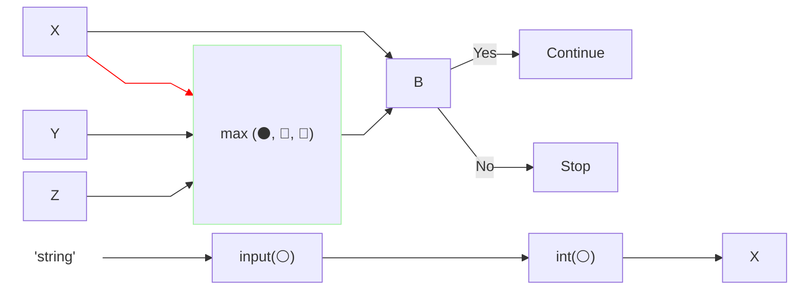

This is a test

```mermaid
%%{init: {'flowchart': {'curve': 'linear', 'nodeSpacing': 10, 'rankSpacing': 50 }}}%%

flowchart LR
  X ---> A
  X ---> B
  Y ---> A
  Z ---> A
  A["<br><br><br>max (⚫, 🔴, 🔵)<br><br><br><br>"] --> B
  B -->|Yes| C[Continue]
  B -->|No| D[Stop]


AAA["'string'"]:::plaintext ---> AA["input(⚪)"] ---> BB["int(⚪)"] ---> CC["X"]


style A stroke:#a2f2a2
linkStyle 0 stroke:red
classDef plaintext fill:none,stroke:none;


```
